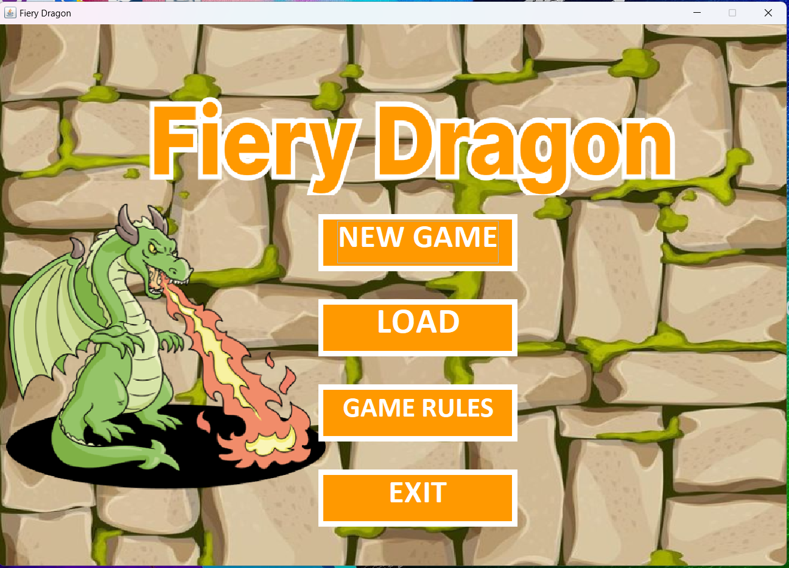
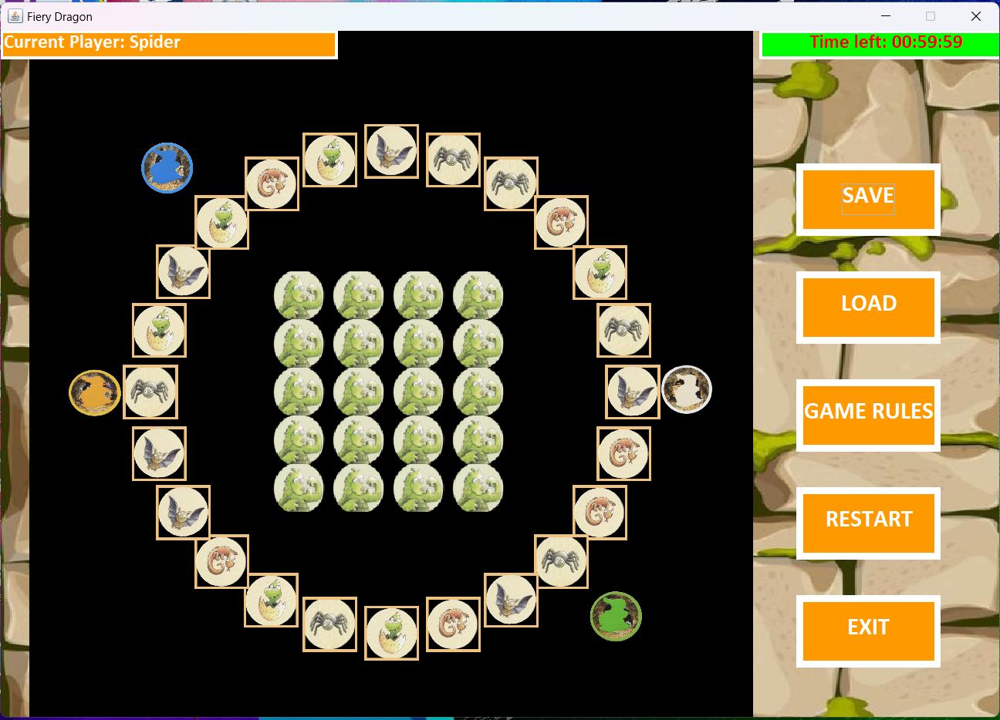

# FIT3077 Sprint 3 - Fiery Dragon (Semester 1, 2024)
Created by:
- Chong Jet Shen
- Chua Wen Yang
- Chen Jac Kern

# Project Description

This repository contains the source code and documentation of Sprint 3 of FIT3077 - Software engineering: Architecture and design.

Fiery Dragons is a memory based game for 2-4 players ages 5-99 and takes about 15 minutes to play.
Players act as dragons trying to get back to their cave by searching for the right cards to help them move.

  

    
  

  

    
  

# Requirement

In Sprint 3, we need to implement the basic game rules for the Fiery Dragon, this includes:
- An ‘initial’ board at the beginning of the game,
- A player flips a Dragon card,
- The dragon token moves correctly based on the last uncovered Dragon card,
- A player uncovers another Dragon card if the turn is not over yet,
- Once a turn is over, flip all the Dragon cards face down for next player’s turn,
- A specific situation where a Dragon Pirate card is uncovered or a different animal (to the
animal shown on the square where your dragon stands) is uncovered or your dragon
would land on an occupied square
- The end of the game.

Besides, we also implement some basic game rules which includes:
- Choosing 2 to 4 dragons to be played in the game.
- Allow the user to choose the dragon to be played, and enter their age.
- The first game start from the player with the smallest age, then pass to next turn
in the clockwise direction.
- If a player wins the game, the new game will start from that player then in clockwise
direction.

For the GUI framework, we also implement the home page of the game and buttons.

---
In Sprint 4, we need to implement two required extensions along with one self-defined extension to the Fiery Dragon game.

Required extensions:
- New Dragon Card 1:
  - Sends the current player to the closest and unoccupied cave which is behind that player. 
  - After sending the player to the nearest cave, the player has another chance to flip another dragon card to move forward. 
  - However, if the player who flips this new dragon card is at the cave, the turn will directly pass to the next player. 

- Loading and saving the game from/to an external (configuration) file:
  - Our team has chosen to implement a saving and loading function by using binary serialisation using “ObjectOutputStream” and “ObjectInputStream” to save and load the game in a binary format. The save method creates a DataStorage object that holds the game and then serialises it into a binary file called “game_save.dat”. Then, when we load the game, the load method reads the DataStorage object from the binary file and the game components are refreshed to reflect the loaded state.
Self-defined extension:
- Time limit per game round:
  - Before starting each round, players will be prompted to set a time limit for the current round.
  - A timer will be displayed during the game, indicating how much time left the players have before the game is forced to end.
  - If a player wins the round before the timer runs out, the timer will stop. This is followed by a winning pop up message, giving a choice to start a new round with the same time limit set. Not much changes from Sprint 3 implementation.
  - However, in the event the timer runs out before a player wins the round. The player closest to the end (back to their cave) will be the winner. The same winning pop up message will appear, and the player has a choice to start a new game with the same time limit set.

# Documentation
Sprint 3:
- Refer to docs/Sprint3 for UML class diagrams and the review of each solution in Sprint 2.

Sprint 4:
- Refer to docs/Sprint4 for revised UML class diagram along with other relevant deliverables.

# Technologies used
- Java
- Java Swing

# Executable
Windows is the main platform for the executable file. Before opening and running the file, you would like to have Java SE Development Kit 22.0.1 and OpenJDK-22 (Oracle OpenJDK version 22.0.1) installed on your machine.
Here is the website link for installation:
https://www.oracle.com/my/java/technologies/downloads/#jdk22-windows 

